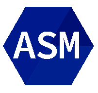

# Marianna

## About Me

 - Recent CS graduate 
    
 - Currently looking for a job as a Junior Software Engineer.

 - Would like to collaborate on OpenSource Projects

 - My CV is available in: www.kanellakis.eu

 

## Languages and Tools
  &emsp;&emsp;&emsp;&emsp;&emsp;&emsp;&emsp;&emsp;&emsp;&emsp;&emsp;&emsp;&emsp;&emsp;&emsp;&emsp;
  
  
  
 ### Connect with me: 
 https://www.linkedin.com/in/marianna-kanellaki-a4b649234/
